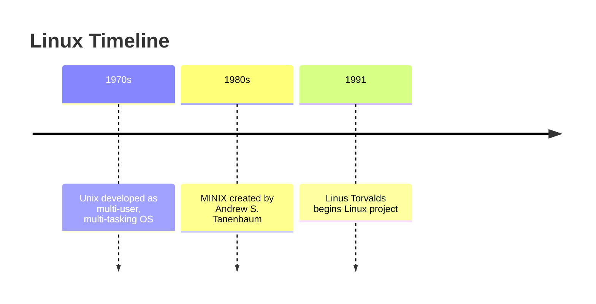

# 🐧 Introduction to Linux

---

## 🆓 Linux is Open Source
- ✅ Freedom to run for any purpose  
- ✅ Freedom to study & modify  
- ✅ Freedom to redistribute copies  
- ✅ Freedom to share modified versions  

---

## 📦 Linux Distributions

**Popular Distros:**
- Ubuntu  
- Fedora  
- Arch  
- KDE / Plasma  
- Mint  
- Manjaro  

**By Difficulty:**
- 🟢 Beginner → Mint, Ubuntu, Elementary, Deepin  
- 🟡 Intermediate → Debian, Fedora  
- 🔴 Advanced → Gentoo  

---

## 📜 History of Linux



---

## ⌨️ Linux Command Line

The command line is a text interface to interact with Linux.  

Also called: **shell**, **terminal**, **console**, **prompt**  

Shortcut to open: **CTRL + ALT + T**  

The shell mediates between **user** and **kernel**.  

---

## 📂 Basic Commands

| Command | Description                |
|---------|----------------------------|
| ls      | List directory contents    |
| cd      | Change directory           |
| pwd     | Print current directory    |
| mkdir   | Create new directory       |
| rmdir   | Remove directory           |

---

## 📖 The `man` Command

The built-in manual pages contain:  
- Description  
- Options & flags  
- Examples  

👉 Example:  
```bash
man ls
man pwd
```
Press **Q** to quit.  

---

## 🔄 cd Command Variants

| Command | Action               |
|---------|----------------------|
| cd ..   | Go up one directory  |
| cd ~    | Go to home           |
| cd /    | Go to root           |
| cd -    | Previous directory   |

---

## 📜 ls Command Options

| Option | Description                       |
|--------|-----------------------------------|
| -l     | Long format (permissions, size)   |
| -a     | Show hidden files                 |
| -h     | Human-readable sizes              |
| -t     | Sort by modification time         |
| -r     | Reverse order                     |
| -S     | Sort by size                      |
| -R     | Recursive listing                 |
| --color=auto | Enable colored output       |
| --group-directories-first | Dirs before files |

👉 Examples:
```bash
ls
ls -l
ls -la
ls -lh
ls -R
```

---

## 🌳 Linux Directory Structure

```mermaid
Root Directory Structure:
    /
    ├── bin:  
    ├── boot  
    ├── dev   
    ├── etc   
    ├── home  
    ├── lib   
    ├── media 
    ├── mnt   
    ├── opt   
    ├── proc  
    ├── root
    ├── run   
    ├── sbin  
    ├── srv   
    ├── sys   
    ├── tmp   
    ├── usr   
    ├── var   
    └── lost+found
    
```

**Key Notes:**
- `/etc` → Core configs (passwords, networking)  
- `/usr` → User applications & libraries  
- `/var` → Variable/log data  
- `/dev` → Device files (/dev/sda1)  

---

## 📂 File Types in Linux

- Ordinary files → text, binaries, images, etc.  
- Directories → containers for files  
- Device files → represent hardware (/dev/sda1)  
- Links → like Windows shortcuts  
- Sockets → inter-process communication  
- Pipes → process-to-process communication  

---

## 📚 Resources

- [Linux.com - What is Linux?](https://www.linux.com/what-is-linux/)  
- [GeeksForGeeks - Linux History](https://www.geeksforgeeks.org/history-of-linux/)  
- [Ubuntu CLI Tutorial](https://ubuntu.com/tutorials/command-line-for-beginners)  
- [Linux Commands Guide](https://linuxcommand.org/)  
- [File Management in Linux](https://www.geeksforgeeks.org/file-management-in-linux/)  