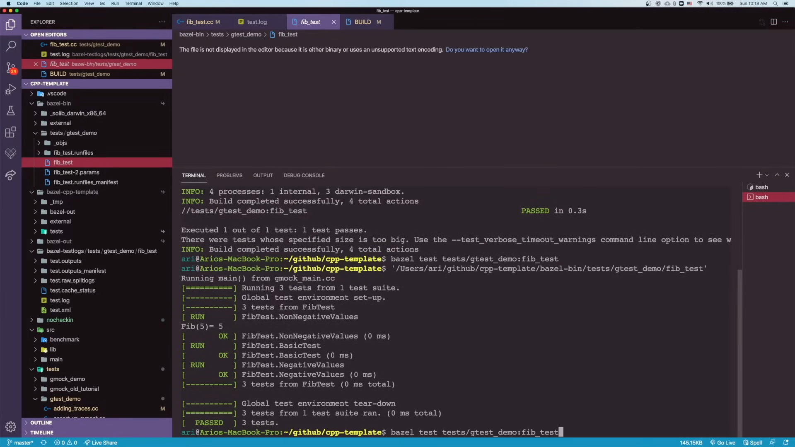
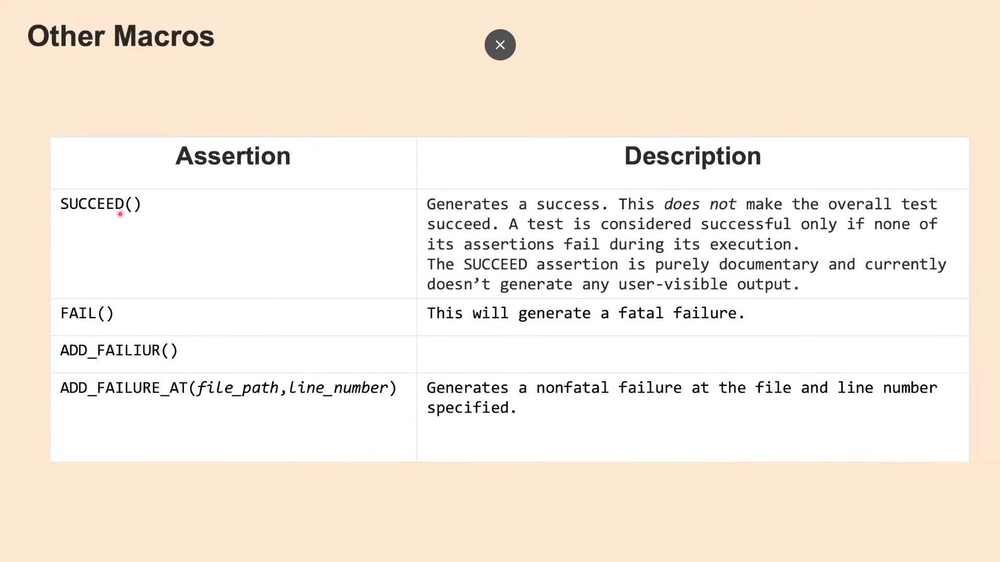

# Google Test and Mock Platform:

### Resources:

- Links:
  - [youtube Channel @arisaif](https://www.youtube.com/@arisaif)
  - [vid0: C++ starter repo for Bazel &amp; Visual Studio Code with GTest, Glog and Abseil](https://www.youtube.com/watch?v=JfOzsBi_irY)
  - [vid1: Google Test and Mock Platform, Complete Tutorial. Part 1: Google Test](https://www.youtube.com/watch?v=JJqRlSTQlh4)
  - [vid2: Google Test and Mock Platform - Part 2: GMock Matchers](https://www.youtube.com/watch?v=sfJobi4b_pw)
  - [vid3: Google Test and Mock Platform - Part 3: Mocking Classes and Functions with GMock](https://www.youtube.com/watch?v=vxCH4AuVRgo)

---

## Vid1: Google Test:

### GTest Assertion Macros

- When using `"EXPECT_TRUE(condition)"` the ***`test continue`*** *if the* **condition fails**.
- When using `"ASSERT_TRUE(condition)"` the ***`test stops`*** *if the* **condition fails**.

- Note that: when using **`user-defined types`** make sure to ***overload these operators***.

- Predicates: are functions that takes 2 inputs, and `return bool`.

### Test Fixture

.

.

### Manipulating Test

