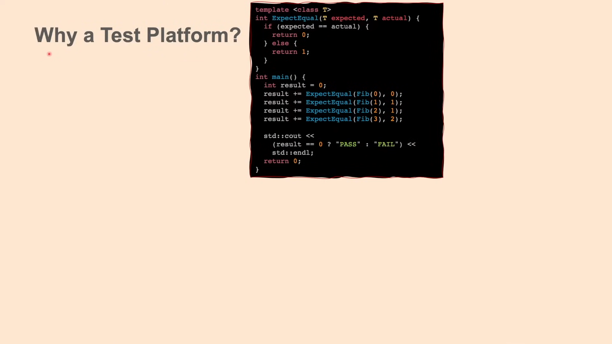

# Google Test and Mock Platform:

### Resources:

- Links:
  - [youtube Channel @arisaif](https://www.youtube.com/@arisaif)
  - [vid0: C++ starter repo for Bazel &amp; Visual Studio Code with GTest, Glog and Abseil](https://www.youtube.com/watch?v=JfOzsBi_irY)
  - [vid1: Google Test and Mock Platform, Complete Tutorial. Part 1: Google Test](https://www.youtube.com/watch?v=JJqRlSTQlh4)
  - [vid2: Google Test and Mock Platform - Part 2: GMock Matchers](https://www.youtube.com/watch?v=sfJobi4b_pw)
  - [vid3: Google Test and Mock Platform - Part 3: Mocking Classes and Functions with GMock](https://www.youtube.com/watch?v=vxCH4AuVRgo)

---

## Vid1: Google Test:

